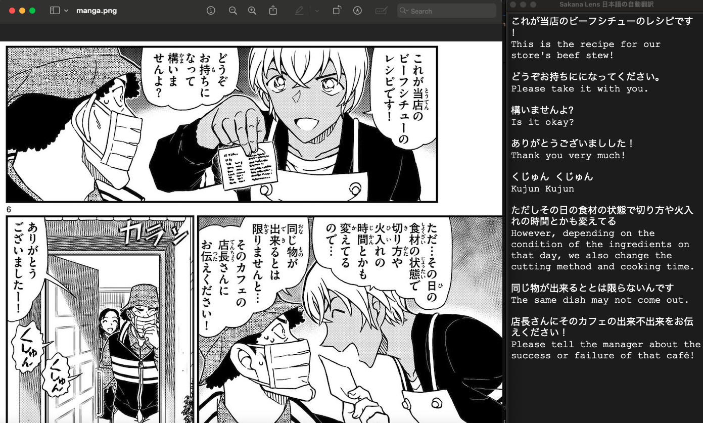
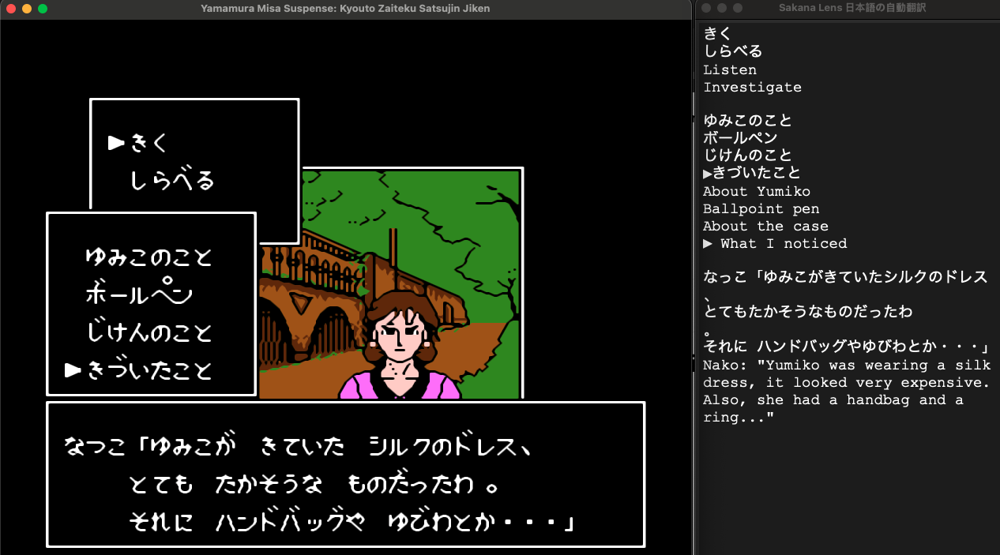
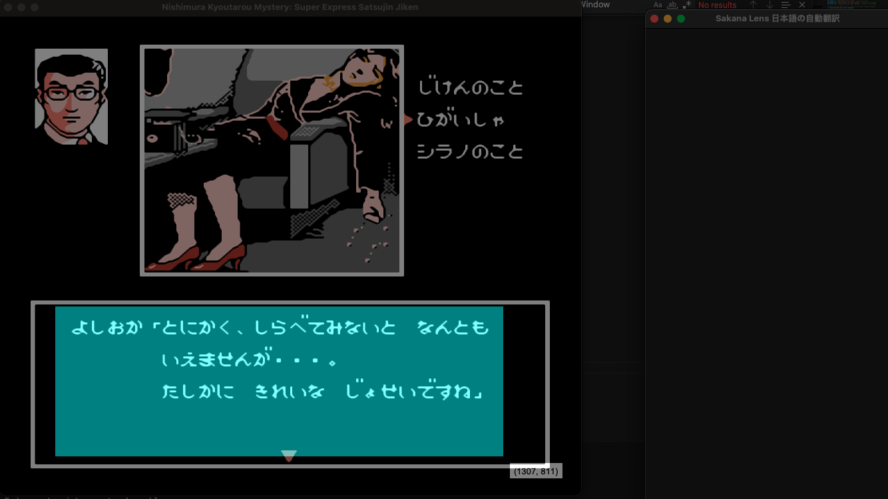

# SakanaLens

## Automatic Japanese-to-English Translation

**SakanaLens** enables seamless translation of Japanese text to English in any active window. With a simple **Ctrl + T** shortcut, you can translate on-screen text without switching applications.

---

## ✨ Features
- **Instant Translation**: Press **Ctrl + T** to trigger translation.
- **Stay Focused**: No need to leave the app you're using.
- **Screen Text Detection**: Automatically translates visible text in the active application.
- **Speech Support**: Converts translated text into speech (English & Chinese only, via Alibaba DashScope).

---

## 🚀 Installation & Setup
### **Step 1: Install Dependencies**
```sh
pip3 install -r requirements.txt
```
### **Step 2: Grant Accessibility Permissions**
To function properly, SakanaLens requires accessibility permissions.
- Open **System Preferences** → **Privacy & Security** → **Accessibility**.
- Add either the app or the terminal if running from the command line.

### **Step 3: Set Up API Key**
- Rename `api_template.json5` to `api.json5`.
- Edit `api.json5` and insert your API key.

### **Step 4: Run the Application**
```sh
python3 sakana_lens.py
```
- Press **Ctrl + T** to trigger translation.

---

## ⚠️ Compatibility
**SakanaLens is currently only supported on macOS.**
```sh
⚠️ This app **CANNOT** run on Windows.
⚠️ You **MUST** grant accessibility permissions for the app or terminal.
```

---

## 🎤 Text-to-Speech (TTS) Support
- Utilizes **Alibaba DashScope** for TTS.
- Supports **English and Chinese**.
- **Japanese TTS is not supported**.
- **Note:** Using DashScope for TTS consumes tokens, which may incur costs.

---

## 📺 Showcase
### **🔎 Webpage Translation**
Translate website text into English effortlessly. 🛜
[](https://www.youtube.com/watch?v=sbTPrqqoixQ)

### **📖 Manga Translation with Speech**
Experience manga translation with text-to-speech functionality. 💬
[](https://www.youtube.com/watch?v=fpw661mpBYI)

### **🖥️ Additional Use Cases**
#### **Web Translation Helper**


#### **Reading Assistance**



#### **Gaming Support**



---

## 🛠️ Contribution & Support
Feel free to contribute to this project! If you encounter issues, please open an [issue](https://github.com/Activebook/SakanaLens/issues) or submit a pull request.

Happy translating! 🎉

