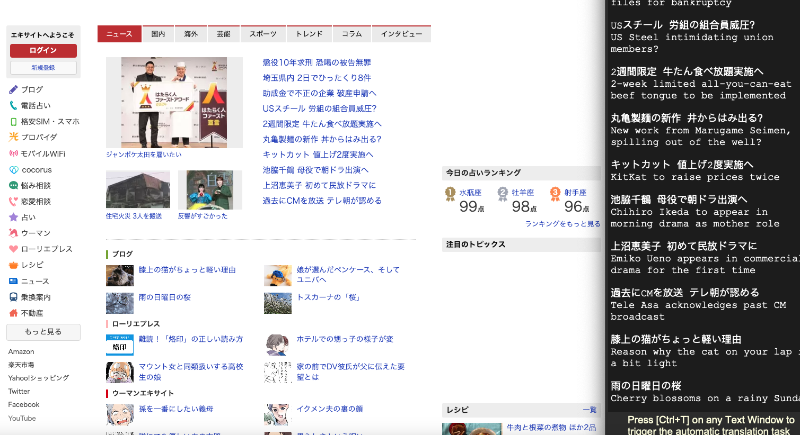

# SakanaLens
 Automatic Translation From Japanese to English

Use ctrl + t to trigger the translation.
You don't need to leave the app you're using.
It will automatically translate the text on the screen of your running app.
 
 **Warning!** This app **cannot be run on Windows**.
 ```
 Now can only run on macOS.
 You must grant the app or terminal(if run on it) to Accessibility on Privacy & Security.
 ```

## **Show cases**
```html
<video width="320" height="240" controls>
    <source src="showcase/case1.mp4" type="video/mp4">
    Your browser does not support the video tag.
</video>
```


